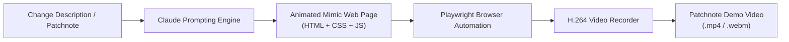

# Web Demo Generator 🎥✨

[](https://opensource.org/licenses/MIT)
[](https://www.typescriptlang.org/)
[](https://github.com/SpaceCorps)

**Web Demo Generator** is an automated tool designed to generate animated video demos of web UI changes for release patchnotes, changelogs, and PR reviews.

By leveraging **Claude** and **headless browser automation (Playwright)**, it transforms natural language change requests or diffs into animated web mockups and records them using the **H.264 video codec**.

---

## 💡 The Idea

When releasing software, writing patchnotes or showcasing pull requests often requires quick, visual demonstration videos of what changed. Manually spinning up environments, positioning windows, and doing screen recordings is slow and tedious.

**Web Demo Generator** automates this pipeline:
1. **Analyze Change**: Provide a patchnote description, PR diff, or feature explanation.
2. **Mimic Web UI**: Claude constructs a self-contained web page that accurately mimics the UI and orchestrates an animation or interactive demonstration loop of the requested change.
3. **Record via Headless Browser**: A headless browser loads the animated mimic page and records the animation directly to an **H.264** video file.
4. **Export Demo**: Output ready-to-share video clips for patchnotes, documentation, and release announcements.

---

## 🏗️ Architecture



---

## 🚀 Quick Start

### Installation

```bash
# Clone repository
git clone https://github.com/SpaceCorps/web-demo-generator.git
cd web-demo-generator

# Install dependencies
pnpm install # or npm install
```

### Environment Variables

Set your Anthropic API key:
```bash
export ANTHROPIC_API_KEY="sk-ant-..."
```

### Basic Usage

```typescript
import { WebDemoGenerator } from '@spacecorps/web-demo-generator';

const generator = new WebDemoGenerator();

const result = await generator.generateDemo({
  changeDescription: "Add a new dark mode toggle switch in the top navigation bar with a smooth moon-sun transition animation",
  targetUrl: "https://example.com",
  durationSeconds: 5,
  outputPath: "./output/patchnote-demo.mp4"
});

console.log(`Demo video saved to: ${result.videoPath}`);
console.log(`Demo steps:`, result.steps);
```

---

## 🛠️ Scripts

- `npm run build` - Build the TypeScript source code
- `npm run dev` - Run TypeScript compiler in watch mode
- `npm run lint` - Type-check the project
- `npm run test` - Run tests with Vitest

---

## 📜 Roadmap

- [x] Initial repository scaffolding and Claude prompting pipeline
- [x] Playwright recording engine with video export
- [ ] Multi-turn refinement loops (evaluating recording quality and adjusting animations)
- [ ] Automated GIF / WebP conversion for embedded release notes
- [ ] Tendril execution pipeline integration for automated PR demo generation

---

## 📄 License

MIT © [SpaceCorps Technology OÜ](https://github.com/SpaceCorps)
