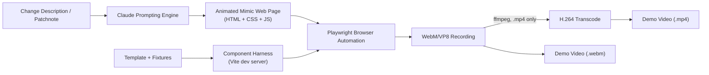

# Web Demo Generator 🎥✨

[](https://opensource.org/licenses/MIT)
[](https://www.typescriptlang.org/)
[](https://github.com/SpaceCorps)

**Web Demo Generator** is an automated tool designed to generate animated video demos of web UI changes for release patchnotes, changelogs, and PR reviews.

By leveraging **Claude** and **headless browser automation (Playwright)**, it turns natural language change requests — or your own real components — into animated demos and records them to video.

---

## 💡 The Idea

When releasing software, writing patchnotes or showcasing pull requests often requires quick, visual demonstration videos of what changed. Manually spinning up environments, positioning windows, and doing screen recordings is slow and tedious.

**Web Demo Generator** automates this pipeline, with two ways to get a page in front of the camera:

1. **Analyze Change**: Provide a patchnote description, PR diff, or feature explanation.
2. **Render the UI**, either
   - **from a component harness** — a Vite dev server mounts a *template* that renders your real, published components with their own stylesheet, theme tokens and fonts, fed by deterministic fixtures (see [Component demos](#-component-demos)); or
   - **from Claude** — for UI you do not have on hand, Claude writes a self-contained page that mimics it and orchestrates the animation.
3. **Record via Headless Browser**: Playwright loads the page, waits for it to paint, replays a scripted interaction tour, and records a **WebM/VP8** video.
4. **Export Demo**: Keep the WebM, or transcode to **H.264 `.mp4`** for patchnotes, documentation and release announcements. Transcoding needs **ffmpeg** — see [Video output and ffmpeg](#-video-output-and-ffmpeg).

---

## 🏗️ Architecture



---

## 🚀 Quick Start

### Installation

```bash
# Clone repository
git clone https://github.com/SpaceCorps/web-demo-generator.git
cd web-demo-generator

# Install dependencies
pnpm install # or npm install
```

### Environment Variables

Set your Anthropic API key:
```bash
export ANTHROPIC_API_KEY="sk-ant-..."
```

### Basic Usage

```typescript
import { WebDemoGenerator } from '@spacecorps/web-demo-generator';

const generator = new WebDemoGenerator();

const result = await generator.generateDemo({
  changeDescription: "Add a new dark mode toggle switch in the top navigation bar with a smooth moon-sun transition animation",
  targetUrl: "https://example.com",
  durationSeconds: 5,
  outputPath: "./output/patchnote-demo.mp4"
});

console.log(`Demo video saved to: ${result.videoPath}`);
console.log(`Demo steps:`, result.steps);
```

Always read `result.videoPath` rather than assuming the path you asked for: without ffmpeg the recorder writes a truthfully named `.webm` instead of an `.mp4`.

### CLI Usage

You can also run the generator directly from the command line:

```bash
# Direct prompt argument
npx web-demo-generator --prompt "Add dark mode toggle to navigation bar" --format mp4

# Load prompt from a template file
npx web-demo-generator --prompt-file ./prompts/demo.md

# Pipe prompt from standard input
cat feature.md | npx web-demo-generator --format mp4
```

Using `--browser firefox` or `--browser webkit` needs that engine's binary downloaded first: run `npx playwright install firefox` or `npx playwright install webkit` before first use.

---

## 🧩 Component demos

Instead of asking Claude to imitate a UI, the harness records the real thing. A **template** is a React module that mounts a component with fixture data; the harness serves it from a Vite dev server on loopback, and the recorder drives a scripted tour of it.

```typescript
import { WebDemoGenerator, TENDRIL_DASHBOARD_SCRIPT } from '@spacecorps/web-demo-generator';

const generator = new WebDemoGenerator();

const result = await generator.generateComponentDemo({
  template: 'tendril/TendrilDashboardDemo',
  theme: 'dark',
  durationMs: 12_000,
  outputPath: './output/dashboard.mp4', // .webm needs no ffmpeg
  interactions: TENDRIL_DASHBOARD_SCRIPT, // this is also the default
});
```

The harness renders components from **`@spacecorps/components-storybook`**, which is private and unpublished. It is therefore *not* an npm dependency — it is resolved from a checkout on disk through a Vite alias:

```bash
git clone https://github.com/SpaceCorps/components-storybook.git ../components-storybook
cd ../components-storybook && pnpm install && pnpm build   # produces dist/tendril.mjs + dist/style.css
```

The harness looks for that checkout in this order: the `componentsPath` option, then `$COMPONENTS_STORYBOOK_PATH`, then the sibling directory `../components-storybook`. If it finds no build output it fails with the missing filename. Tests that need real components skip themselves when it is absent, so `npm test` passes either way — set `COMPONENTS_STORYBOOK_PATH` to actually exercise them.

Templates live in `src/templates/` and ship as **source**: Vite transforms them at harness startup, so `tsc` excludes them (their imports only resolve through the harness alias). Type-check them separately with `npm run lint:templates`. `tsc` cannot read `COMPONENTS_STORYBOOK_PATH`, so that project resolves the components types through `paths` pointing at the sibling `../components-storybook` checkout; for a checkout elsewhere, extend `src/templates/tsconfig.json` and override `paths`.

---

## 🎞️ Video output and ffmpeg

Playwright records **WebM/VP8 only** — that is the browser's own recorder, and no option changes it. H.264 therefore means a transcode:

| `outputPath` | `transcode` | ffmpeg | Result |
| --- | --- | --- | --- |
| `.webm` | `'auto'` (default) | not needed | the recording, as-is |
| `.mp4` | `'auto'` | found | `.mp4`, H.264 `yuv420p` |
| `.mp4` | `'auto'` | missing | **throws**, naming the install command; the raw `.webm` is kept |
| `.mp4` | `'off'` | not used | a `.webm` file — the extension is corrected to match the payload |
| any | `'require'` | must exist | throws if ffmpeg is missing, even for `.webm` |

Install ffmpeg with `brew install ffmpeg` (macOS), `apt install ffmpeg` (Debian/Ubuntu), or point `FFMPEG_PATH` at a binary. The recorder never renames a WebM payload to `.mp4`: a file that will not play in QuickTime is worse than an error message.

---

## 🛠️ Scripts

- `npm run build` - Build the TypeScript source code
- `npm run dev` - Run TypeScript compiler in watch mode
- `npm run lint` - Type-check the project
- `npm run lint:templates` - Type-check `src/templates/` (requires the sibling components checkout)
- `npm run test` - Run tests with Vitest

---

## 📜 Roadmap

- [x] Initial repository scaffolding and Claude prompting pipeline
- [x] Playwright recording engine with video export
- [x] Component harness with scripted interaction tours and H.264 transcoding
- [ ] Multi-turn refinement loops (evaluating recording quality and adjusting animations)
- [ ] Automated GIF / WebP conversion for embedded release notes
- [ ] Tendril execution pipeline integration for automated PR demo generation

---

## 📄 License

MIT © [SpaceCorps Technology OÜ](https://github.com/SpaceCorps)
